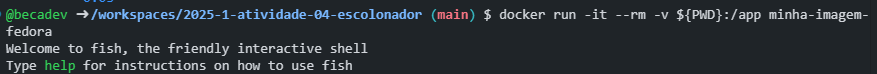
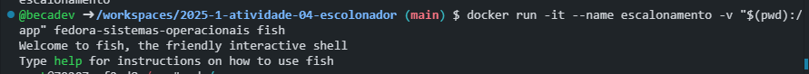
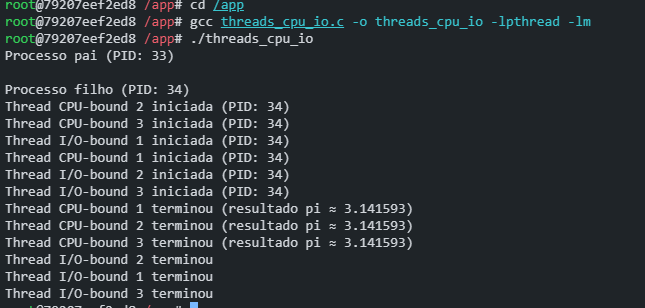
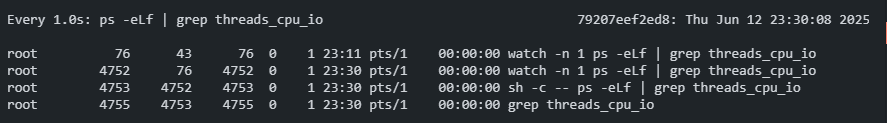
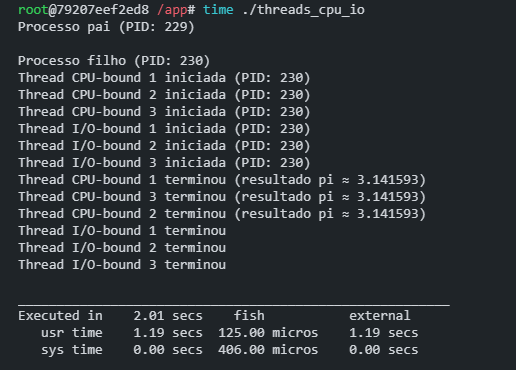

# Relatório

**Nome:** Reebca Noemi  
**Data:** 16/05/2025


### **1. Programa **   
  1.1. Construção da imagem docker
  ``` c
  #include <stdio.h>
  #include <stdlib.h>
  #include <unistd.h>
  #include <pthread.h>
  #include <sys/wait.h>

  // Thread CPU-bound (cálculo de pi)
  void* cpu_thread(void* arg) {
      printf("Thread CPU-bound %ld iniciada (PID: %d)\n", (long)arg, getpid());
  
      // Cálculo de pi pela série de Leibniz
      double pi = 0.0;
      long num_iter = 100000000;
      for (long i = 0; i < num_iter; i++) {
          pi += (i % 2 == 0 ? 1.0 : -1.0) / (2.0 * i + 1.0);
      }
      pi *= 4.0;
  
      printf("Thread CPU-bound %ld terminou (resultado pi ≈ %f)\n", (long)arg, pi);
      return NULL;
  }
  
  // Thread I/O-bound
  void* io_thread(void* arg) {
      printf("Thread I/O-bound %ld iniciada (PID: %d)\n", (long)arg, getpid());
      sleep(2);  // Simula operação I/O
      printf("Thread I/O-bound %ld terminou\n", (long)arg);
      return NULL;
  }
  
  int main() {
      pid_t pid;
      pthread_t cpu1, cpu2, cpu3;
      pthread_t io1, io2, io3;
  
      pid = fork();
  
      if (pid == 0) { // Filho
          printf("\nProcesso filho (PID: %d)\n", getpid());
  
          pthread_create(&cpu1, NULL, cpu_thread, (void*)1);
          pthread_create(&cpu2, NULL, cpu_thread, (void*)2);
          pthread_create(&cpu3, NULL, cpu_thread, (void*)3);
  
          pthread_create(&io1, NULL, io_thread, (void*)1);
          pthread_create(&io2, NULL, io_thread, (void*)2);
          pthread_create(&io3, NULL, io_thread, (void*)3);
  
          pthread_join(cpu1, NULL);
          pthread_join(cpu2, NULL);
          pthread_join(cpu3, NULL);
          pthread_join(io1, NULL);
          pthread_join(io2, NULL);
          pthread_join(io3, NULL);
  
      } else if (pid > 0) {
          printf("Processo pai (PID: %d)\n", getpid());
          wait(NULL);
      }
  
      return 0;
  }

  ```

### **2.Comparação do tempo de execução**  
  2.1. Comando no host: </br>
  
  
  ---------- 
  2.2. Comandos: </br>
  
  
  
  ---------- 
  2.3. Monitoração CPU:  </br>
  
  
  ----------
  2.4. Medição de tempo: </br>
  

